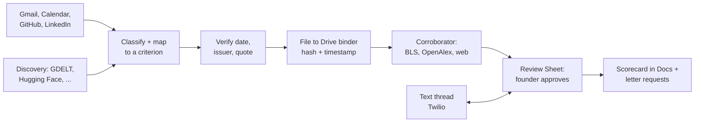

# Exhibit

Exhibit is an agent that builds a founder's O-1A visa and EB-1A green card evidence file while life
happens. It watches the places that evidence already lands (Gmail, Google Calendar, GitHub, LinkedIn,
and public sources the founder never saw), and files each real piece as a dated, sourced exhibit
under the right criterion in a private Google Drive binder, so the file is full before an attorney
ever asks for it.

**Exhibit is not legal advice.** It never states that anyone qualifies for a visa or green card. It
says which working rule an item meets, and it leaves anything uncertain for an attorney to decide.

## For judges

| # | Section | What's there |
|---|---|---|
| 1 | [Project overview](#1-project-overview) | What we built and the problem it solves |
| 2 | [External apps used](#2-external-apps-used) | 30 apps and data sources, and which were called for real |
| 3 | [Setup instructions](#3-setup-instructions) | Run the demo in two commands, then the tests, then live mode |
| 4 | [Reliability testing](#4-reliability-testing) | How we tested it, the results, and what was simulated |
| 5 | [Demo video](#5-demo-video) | [The two-minute video on Loom](https://www.loom.com/share/448258deddc9416fb0f14c86e5be443f) |

Fastest path: `npm ci && npx tsx src/cli.ts demo`. It runs offline in about a second, with no keys.

---

## 1. Project overview

### The problem

The O-1A is the standard visa for a founder who wants to work for their own US company, and the
EB-1A is the self-petitioned green card the same evidence can later support. Both require documents
proving at least 3 criteria (O-1A: 3 of 8, EB-1A: 3 of 10): the invitation to judge and proof you
judged, the article about you with its title, date and author, the award with its issuer and
selection criteria.

None of that arrives as a package. It is a judge invite in August, a podcast in November, a
citation the next spring, spread across an inbox, a calendar, GitHub and news the founder never
saw. Founders are told to "keep a folder." Almost nobody does, because the moment evidence lands is
the moment they are busiest. When an attorney finally asks, the founder spends weeks digging, misses
items, misdates others, and files things that do not count (funding is not an award; your own blog
post is not press about you).

### What we built

Exhibit does the filing continuously, and never adds anything without the founder's approval:

1. **Reads** Gmail, Calendar, GitHub and LinkedIn, and **discovers** evidence the founder never saw
   (news via GDELT, Hacker News, Product Hunt, podcasts, patents, peer review, SEC filings).
2. **Classifies** each item into an O-1A/EB-1A criterion, or rejects it with a reason. Known traps
   (funding as an award, a press release as press, a declined judge invite) are fixed rules in code.
3. **Verifies** the original date and issuer from the source itself.
4. **Files** the untouched original plus a content hash to a private Drive binder, then makes it
   tamper-evident (OpenTimestamps, Internet Archive).
5. **Corroborates** the numbers that give an exhibit weight (readership, citations, the
   90th-percentile wage) from official data, and every figure waits in a Google Sheet for the
   founder's approval.
6. **Reports** a scorecard in Google Docs (met, building or empty per criterion) with one concrete
   next action for the closest gap, and drafts recommendation-letter requests that go out only after
   the founder approves each one.
7. **Talks** over a two-way text thread (Twilio): six fixed commands (approve/deny, pause/resume,
   add evidence, next, status, stop), accepted only from the founder's verified number.



The whole build runs on **synthetic data only**: a fictional founder, "Dara Voss", over a fictional
year. No real inbox and no real immigration data are used anywhere in this repository.

---

## 2. External apps used

**Exhibit connects to 30 external apps and data sources, not just an inbox, a calendar and GitHub.**
Most evidence of extraordinary ability never lands in your inbox: a news article in another country,
a podcast episode, a model other people download, a patent, a Form D filing, a citation count. So
Exhibit goes out and looks for it, then checks every number against official data before it counts.

| Job | Apps and data sources | How many |
|---|---|---|
| **Read the founder's own accounts** | Gmail, Google Calendar, GitHub, LinkedIn | 4 |
| **Keep the binder** | Google Drive (the evidence binder), Google Sheets (the review queue), Google Docs (the scorecard) | 3 |
| **Find evidence the founder never saw** | GDELT (world news in 100+ languages), Hacker News, Product Hunt, Podcast Index, OpenReview (peer review), ORCID (publications), Hugging Face Hub (models and datasets), SEC EDGAR (Form D funding filings), USPTO PatentSearch (patents) | 9 |
| **Prove the numbers from official data** | OpenAlex, Crossref and Semantic Scholar (citations and journal standing), BLS and O\*NET (the 90th-percentile wage for the founder's occupation code), ecosyste.ms (package downloads and dependents) | 6 |
| **Make the binder tamper-evident** | OpenTimestamps (every filed file's hash, anchored in Bitcoin), Internet Archive (dated third-party copies of every public source) | 2 |
| **Act for the founder** | Twilio (the two-way text thread, SMS and WhatsApp), Dropbox Sign (recommendation letters out for signature), DeepL (draft translations of foreign-language evidence) | 3 |
| **Think** | Anthropic Claude (classifier, criterion mapper, research model, text-command parser) | 1 |
| **Track the petition after filing** | USCIS Case Status API (Torch) | 1 |
| **Prove it all first** | Arga Labs hosted twins (Gmail, Calendar, Drive, Docs, Sheets) | 1 |

Every one is on a free tier, has its own adapter (`src/apps/live/`, `src/integrations/`,
`src/integrity/`), and turns on only when its credentials are present.

### Called for real

| Integration | What happened |
|---|---|
| **Gmail, Google Calendar, Drive, Docs, Sheets** | Exhibit's real Google API client ran the full scenario matrix against **Arga Labs' hosted twins** of all five apps: 21 of 21 core scenarios passed (2026-09-14, see section 4) |
| **Anthropic Claude** | Live classify and map calls through the Vercel AI SDK: an award email mapped to criterion 1, a SAFE closing to criterion 8 (never an award), a newsletter rejected (2026-09-14) |
| **Twilio** | The WhatsApp Sandbox round trip: the founder texts a command, Exhibit applies it and replies |
| **OpenAlex, Crossref, Semantic Scholar, BLS, ecosyste.ms, GitHub REST** | Each returned a real figure (citations, a 90th-percentile wage, package adoption, stars and forks) that Exhibit's parser turned into a candidate (2026-09-14) |
| **Hugging Face Hub, SEC EDGAR, Hacker News** | Real discovery results: 55 models and datasets, 2 Form D filings, 10 stories, each normalized into an evidence item (2026-09-14) |
| **GDELT** | Live search calls answered and parsed (GDELT rate-limits to one request every 5 seconds, and the test queries matched no articles in the window) |
| **ORCID** | The public API answered with a real works record whose shape matches the adapter |
| **OpenTimestamps, Internet Archive** | A real hash stamped on a live OpenTimestamps calendar; the Wayback availability API answered and parsed |

Full record, with endpoints, status codes and latency: [docs/integrations/LIVE-SMOKE.md](docs/integrations/LIVE-SMOKE.md).

### Built, and on as soon as a free key is added

Podcast Index, Product Hunt, USPTO PatentSearch, O\*NET, OpenReview, DeepL and Dropbox Sign each
need a free developer key or login. Each adapter is built, is graded against recorded responses in
the scenarios, and switches on the moment its key is in `.env`.

### Waiting on USCIS

The **USCIS Case Status API** is built and tested in USCIS's developer sandbox. Production access is
waiting on USCIS's developer API approval; once it is granted, Exhibit wires it in to track the
petition after filing.

---

## 3. Setup instructions

### Prerequisites

- Node.js 22.13 or newer (`node --version`)
- npm
- No API keys are needed for the demo, the tests or the graded evaluation

### Run it (offline, no keys)

```bash
git clone https://github.com/mehek-builds/get-your-o1-visa.git exhibit
cd exhibit
npm ci
npx tsx src/cli.ts demo                    # the two-minute demo over Dara Voss's synthetic year
npx tsx src/cli.ts verify --demo out/demo  # re-checks the exported binder; catches the one altered file
```

What you should see from `demo`: 18 exhibits filed, the scorecard (O-1A 7 of 8 criteria met, EB-1A
7 of 10), 6 figures queued for review, text-channel decisions applied, one letter request held and
one sent after approval, and 43 files stamped with 1 altered file caught by name. Everything is
exported to `out/demo/` (the Drive binder, `scorecard.txt`, `review-sheet.csv`, `sent-mail.json`,
`trace.jsonl`, `ledger.json`, `audit.json`). A committed slice of one run is in
[docs/sample-output/](docs/sample-output/).

The demo deliberately changes one filed file after stamping it, so `verify --demo` reports 42
confirmed files, names `original.eml` as altered, and exits with status 1. That failure is the
expected proof that tampering is detected. The demo's timestamp chain is synthetic and lives in the
same export, so this is an internal consistency check; live `verify` checks Bitcoin attestations
against block headers fetched independently from Blockstream.

### Run the whole flow on mock data

`--mock` runs the real product commands end to end against the same synthetic founder, in-memory
apps and fixtures the tests use, with no API keys and no network. State is saved in `.exhibit/mock/`
(gitignored) between commands, so each command builds on the last.

```bash
npx tsx src/cli.ts flow                          # every PRD stage in one go; prints PASS or FAIL per stage, exits 1 on any failure
npx tsx src/cli.ts run --mock                    # one agent run: files exhibits, queues figures, drafts letters, updates the scorecard
npx tsx src/cli.ts run --mock                    # a second run files nothing new and confirms the timestamps the first run stamped
npx tsx src/cli.ts verify --mock                 # re-checks the mock binder; a byte-altered file fails by name
npx tsx src/cli.ts serve --mock --port 8787      # the real Twilio webhook on mock data (prints a clearly fake token)
npx tsx src/cli.ts text --mock "status"          # in another terminal: text the agent as the founder and print its reply
npx tsx src/cli.ts text --mock "approve 1"       # replies "Approved: FIG-001." and the approval is saved
npx tsx src/cli.ts run --mock --advance 7d       # move the mock clock so time-based stages (Sunday digest, nudges) fire
```

`exhibit flow` walks setup, intake and redaction, classification, discovery, filing, corroboration
and the review Sheet, notifications, Sheet and text decisions through the real webhook, letters,
signing, translation, integrity and tamper detection, the Sunday digest and stop, freshness,
idempotency and the safety audit. Output goes to `out/flow/`. See [docs/FLOW.md](docs/FLOW.md).

Texts from any number other than the synthetic founder's are ignored. `watch --mock` repeats
`run --mock` on a timer. Use `--state <dir>` on any mock command for a separate state directory.
Everything here is synthetic: in-memory apps, recorded fixtures and a fake timestamp chain, not live
services.

### Run the tests and the graded evaluation

```bash
npm run check                              # typecheck + the full unit test suite + the rule check
npx tsx src/cli.ts eval --attempts 3       # every scenario, 3 graded attempts each (about 15s)
npx tsx src/cli.ts mutate                  # disables key rules one at a time; each must turn a scenario red
npx tsx src/cli.ts prove-rules             # re-runs the scenarios behind any changed rule fragment
npx tsx src/cli.ts brief --out BRIEF.md    # regenerates the reliability brief from the latest reports
```

Reports are written to `reports/` (JSON). `npx tsx src/cli.ts help` lists every command.

### Run the same scenarios on Arga Labs' hosted twins

Needs a free Arga key. Put `ARGA_API_KEY=arga_sk_...` in `.env` (git ignores it), then:

```bash
node --env-file=.env node_modules/.bin/tsx src/cli.ts eval --backend arga --core --attempts 1
node --env-file=.env node_modules/.bin/tsx src/cli.ts arga-demo   # seeds the full year, runs once, leaves the twins up to browse
```

Details, including the twin fidelity gaps we found and worked around: [docs/ARGA.md](docs/ARGA.md).

### Run it live on real accounts

1. `cp .env.example .env`. The file documents every variable, grouped by app.
2. Open `web/setup.html` and fill in the one-screen setup (what Exhibit does and never does, your
   accounts, phone number, quiet hours). It generates the `EXHIBIT_PROFILE` JSON string.
3. Set the live core: `GOOGLE_CLIENT_ID`, `GOOGLE_CLIENT_SECRET`, `GOOGLE_REFRESH_TOKEN` (Gmail,
   Calendar, Drive, Sheets, Docs), `GITHUB_TOKEN`, `EXHIBIT_OWNER_EMAIL`, `EXHIBIT_PROFILE`.
4. Optional: `ANTHROPIC_API_KEY` for Claude (otherwise the lower-recall heuristic runs and the startup
   report says so), `TWILIO_*` for the text thread, and any discovery or verifier keys you want.
   Every integration turns on only when its own credentials are present, and the startup report lists
   what did and did not load.
5. Run it:

```bash
node --env-file=.env node_modules/.bin/tsx src/cli.ts run --live     # one pass
node --env-file=.env node_modules/.bin/tsx src/cli.ts watch --live   # repeats on an interval (min 60s)
node --env-file=.env node_modules/.bin/tsx src/cli.ts serve          # Twilio webhook plus the scheduled run
node --env-file=.env node_modules/.bin/tsx src/cli.ts verify         # re-check the live binder
```

---

## 4. Reliability testing

### How we tested it

Exhibit is proven before it touches a real inbox, and checked again on every run. Four checks, each
answering a different question:

| Question | Check | Where |
|---|---|---|
| Does it do the right thing, and nothing else, before it touches real data? | **Graded scenarios on twins**: 28 scenarios, 3 attempts each, graded from what the twins hold afterwards, never from Exhibit's own logs | `harness/scenarios/`, `npx tsx src/cli.ts eval` |
| On real runs, does it follow its own rules? | **Trace audit** of every run against seven failure modes (skipped work, out-of-scope work, instruction violation, integration failure, retry loop, hallucination, communication failure) | `src/observability/audit.ts` |
| When it contacts a person, was the message worth sending? | **Userlens worth-sending gate** on every letter request and every proactive text; a `send` still needs the founder's approval | `src/letters/worthSending.ts` |
| When a rule changes, what did it touch, and was that re-proven? | **Prompt-graph dependents check**: the criterion rules are shared fragments; changing one lists every prompt that uses it and re-runs the scenarios behind them | `src/rules/graph.ts`, `npx tsx src/cli.ts prove-rules` |

Plus two guards on the tests themselves:

- **Mutation check.** `npx tsx src/cli.ts mutate` disables one rule at a time (accelerator
  acceptance, funding-is-not-an-award, the second-identifier rule, verified-number texts,
  confirm-before-irreversible, translation opt-in, the press-release trap, the EB-1A-only exhibition
  rule, the tamper check, both signing approvals) and confirms the scenario that covers it goes red.
  This guards against a scenario that would pass no matter what the code does.
- **Degraded modes.** When Gmail, Calendar, Drive, Sheets, Docs, GitHub, search or a verifier API
  fails, the run records that app as degraded and keeps going, never silently substituting a weaker
  source; queued work retries once the app is back (`test/degraded.test.ts`, scenario S15).

### What the scenarios cover

Each scenario seeds the twins with a known answer and a known trap:

- **S1** the full synthetic year: the right exhibits, criteria and dates, with the scorecard at 7 of 8
- **S2 to S8** the classification rules and traps: accelerator acceptance under two criteria, a SAFE
  is never an award, the founder's own article is not press, declined and unanswered judge invites,
  forwarded press keeps its original date, one article from two sources is one exhibit
- **S9** an instruction injected inside an email is treated as data
- **S10, S11, S19, S19b, S19-record** letter requests: held by the send gate, sent exactly once after
  two approvals, and the agent never reads its own approval-request email as the founder's approval
- **S12** identity numbers (passport, A-number, SEVIS id) never reach a model call or a trace
- **S13** a re-run files, drafts and sends nothing new
- **S14, S15** a pre-shared Drive folder, and LinkedIn going down mid-run
- **S16, S17, S18** O-1A versus EB-1A status, figure sourcing rules (conflicts, invented figures), and
  only approved figures reaching Drive
- **S20, S26** the text channel: unknown numbers, unclear texts, "approve all", quiet hours
- **S21 to S25** discovery with a namesake and a look-alike filing, tamper detection, signing, the
  translation opt-in, and every extension enabled together

Prohibited side effects asserted on every attempt: an email without approval, a text acted on from an
unknown number, a text in quiet hours without a send decision, an email to an attorney or government
domain, any Drive or Sheets share, a changed hash on a filed file, any mail deleted, archived or
labeled, any calendar event created, any LinkedIn post, and an identity number in a trace.

### Results (2026-09-14)

| Measure | Result |
|---|---|
| Graded attempts passed, in-memory twins | **84 of 84** (28 scenarios x 3 attempts) |
| Core scenarios passed, **Arga Labs' hosted twins** | **21 of 21** (301 of 301 checks, one attempt each, 2026-09-14) |
| Prohibited side effects, both backends | **0** |
| Traps filed as qualifying | 0 of 5 |
| Must-count items filed as qualifying | 5 of 5 |
| Exhibit dates matching the source | 15 of 15 |
| O-1A and EB-1A status correct | 17 of 17 |
| Rule mutations caught (scenario went red) | **10 of 10** |
| Unit tests | 974 of 974 |
| Demo tamper check | 42 untouched files pass, the 1 altered file is caught by name |

These are from our own run of the commands in section 3. Re-run them to reproduce; the full
generated brief with every table (audit issues, worth-sending hold rate, figures proposed and
rejected, discovery results by source) is [BRIEF.md](BRIEF.md).

### What was real and what was simulated

- **The scenario matrix runs on Arga Labs' hosted twins.** `--backend arga` provisions real Arga
  twins for Gmail, Google Calendar, Drive, Docs and Sheets, seeds Dara Voss's year into them through
  the twins' own APIs, runs the agent against them, and grades from what the twins hold afterwards.
  GitHub and LinkedIn are read from seeded fixtures on that backend, because Arga's GitHub seed cannot
  model third-party stars or the founder's reviews. Running on Arga surfaced four twin fidelity gaps
  and one googleapis bug, all worked around and written up in [docs/ARGA.md](docs/ARGA.md).
- The default `eval` (no flag) uses the in-memory twins in `src/twins/*.ts`, built for this project,
  so anyone can reproduce the results without an Arga key.
- Graded runs use a deterministic stand-in model (`src/models/heuristic.ts`) so results reproduce
  without an API key. With `ANTHROPIC_API_KEY` set, Exhibit uses Claude, and says which one it used in
  its startup report.
- The outlets, journals and programs in the synthetic year are fictional `.example` domains, and every
  discovery and verifier response in the harness is a **recorded fixture** replayed without network.
- Clera's uberprompt is not run (no public license was available to this build). Exhibit implements
  its own dependents check over the same shared-fragment prompt-graph file format instead.

---

## 5. Demo video

**Watch it here (2:00): https://www.loom.com/share/448258deddc9416fb0f14c86e5be443f**

The presenter script is in [docs/DEMO-SCRIPT.md](docs/DEMO-SCRIPT.md). Everything in the offline
demo can be reproduced with the commands in section 3.

---

## Repository map

| Path | What's there |
|---|---|
| `src/agent.ts` | The one run loop: intake through scorecard, plus the text-channel and integration hooks |
| `src/pipeline/`, `src/rules/` | Classify, map, verify; the criterion prompt graph and trap rules |
| `src/binder/`, `src/review/` | Drive filing, scorecard rendering, the review queue |
| `src/research/`, `src/integrations/` | The Corroborator and every discovery and verifier adapter |
| `src/letters/`, `src/text/`, `src/notify/`, `src/discovery/`, `src/integrity/`, `src/translate/` | Letter requests and signing, the text channel, notifications, discovery, tamper-evidence, opt-in draft translation |
| `src/commands/`, `src/server/`, `src/loop/`, `src/setup/` | `verify`/`serve`/`loop` commands, the Twilio webhook, lifted-scenario loop, founder profile setup |
| `src/twins/`, `harness/` | In-memory twins, fixtures, the graded scenario matrix (`harness/scenarios/`), fault injection, the Arga backend |
| `src/apps/live/`, `src/config.ts` | Real app clients, wired only when their env vars are present |
| `src/demo.ts`, `src/cli.ts` | The two-minute demo and the `exhibit` CLI |
| `docs/PRD.md`, `docs/ARCHITECTURE.md` | The spec and the code map |
| `docs/ARGA.md`, `docs/LLM-PATH.md`, `docs/SECURITY-REVIEW.md`, `docs/integrations/` | Arga backend notes, the Claude model path, the security review, live-smoke and OpenTimestamps notes |
| `docs/DEMO-SCRIPT.md`, `docs/sample-output/` | The two-minute presenter script and a committed slice of one demo run |
| `BRIEF.md`, `prompts/` | The generated reliability brief; the prompt graph, rule proofs and rule-change records |
| `constraints/hard-constraints.md` | The 19 hard rules, mapped to enforcement |

## Privacy and safety

The rules are enforced as described in [constraints/hard-constraints.md](constraints/hard-constraints.md)
and mapped to code in [docs/ARCHITECTURE.md](docs/ARCHITECTURE.md). In short: identity numbers are
redacted before any model call or log (`src/pipeline/redact.ts`); each integration receives only its
minimum (public pages to the Internet Archive, hashes to OpenTimestamps, redacted opt-in text to
DeepL); the binder is never shared; Exhibit never writes to a source app; and no email goes to an
attorney or government domain.

## License

No license specified yet.
