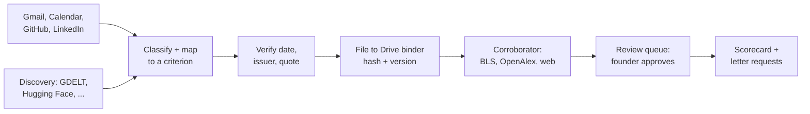

# Exhibit

Exhibit watches the places a founder's extraordinary-ability evidence already lands — Gmail,
Google Calendar, GitHub, LinkedIn, and public sources she never saw — and files each real piece as
a dated, sourced exhibit under the right O-1A/EB-1A criterion, so the file is full before an
attorney ever asks for it.

**Exhibit is not legal advice.** It never states that anyone qualifies for a visa or green card. It
says which working rule an item meets, and it leaves anything uncertain for an attorney to decide.

## How it works

A classifier and criterion mapper sort each item into one of the O-1A/EB-1A criteria (or reject it,
with a reason); a verifier confirms the original date and issuer; a filer writes the untouched
original plus a content hash to a private Drive binder; a Corroborator researches the numbers that
give an exhibit weight, using structured verifier APIs first and restricted web search second;
every figure and every letter request waits for the founder's own decision before anything is
written or sent.



**PRD 6.13 — the text channel.** A two-way message thread (Twilio, free trial: graded over SMS in
Arga's Twilio twin, live on the WhatsApp Sandbox) turns every inbound text into exactly one of six
fixed commands — approve/deny, pause/resume, add evidence, next, status, stop — using structured
output, and never acts on a text from any number but the founder's verified one.

**PRD 6.14 — the integration lineup.** Beyond Google and GitHub, Exhibit finds evidence the founder
never saw (GDELT, Hacker News, Product Hunt, OpenReview, ORCID, Hugging Face, SEC EDGAR, USPTO),
takes numbers from official data (OpenAlex, Crossref, Semantic Scholar, BLS, O*NET), makes the
binder tamper-evident (Internet Archive, OpenTimestamps), and sends letters for signature (Dropbox
Sign) — every integration on a free tier.

## Quickstart

```bash
npm ci
npx tsx src/cli.ts demo                    # the two-minute demo (PRD 14), on the full synthetic year
npx tsx src/cli.ts eval --attempts 3       # runs the Arga scenario matrix, 3 attempts each, graded from twin state
npx tsx src/cli.ts mutate                  # disables key rules one at a time; each must turn a scenario red
npx tsx src/cli.ts prove-rules             # re-runs the scenarios behind any changed rule fragment
npx tsx src/cli.ts brief --out BRIEF.md    # regenerates BRIEF.md's numbers from the latest reports
npx tsx src/cli.ts verify --demo out/demo  # checks internal consistency against the exported synthetic fixture chain
```

The demo deliberately changes one filed artifact after stamping it. The final `verify --demo`
command therefore reports 42 confirmed files, names the altered file, and exits with status 1. That
failure is the expected proof that tampering is detected. Live verification uses `verify` without
`--demo` and requires the live Google, GitHub, owner-email, profile, and ledger configuration below.
Because the demo's synthetic chain manifest lives in the same export, this command is an internal
consistency check, not an independently anchored timestamp. The live verifier checks Bitcoin
attestations against block headers fetched independently from Blockstream.

`npx tsx src/cli.ts help` lists the rest (`affected`, `check-rules`, `lift`, `run --live`,
`watch --live`, `serve`, `loop`). `npm run check` runs typecheck, tests and the rule check;
`npm run eval`, `npm run brief` and friends in `package.json` wrap the same commands.

## Run the whole flow on mock data

`--mock` runs the entire product end to end -- discovery, filing, review, letters, signing,
translation, integrity timestamping, and the Twilio text channel -- against the same synthetic
founder, in-memory twins and fixtures the harness uses, with no live keys and no network. State
persists in `.exhibit/mock/` (already gitignored) across invocations, so `run --mock` twice in a
row files nothing new the second time.

```bash
npx tsx src/cli.ts run --mock                    # one agent run: files exhibits, drafts letters, updates the scorecard
npx tsx src/cli.ts serve --mock                   # Twilio webhook + scheduled run, on mock deps (prints the fake auth token and mock public URL)
npx tsx src/cli.ts text --mock "approve 1"        # texts your local serve --mock as the synthetic founder, prints the reply
npx tsx src/cli.ts run --mock --advance 7d        # advances the mock clock a week, so time-based stages (digest, nudges) fire
npx tsx src/cli.ts verify --mock                  # re-checks the mock binder against the synthetic fixture chain saved alongside it, not Bitcoin mainnet
```

`watch --mock [--interval <s>] [--advance-per-tick <dur>]` repeats `run --mock` on a timer, saving
state on every tick and on Ctrl-C. `--mock` and `--live` cannot be combined on any of `run`, `watch`,
`serve` or `verify`. Use `--state <dir>` on any mock command to point at a different state directory
than the default `.exhibit/mock/`.

`run --mock` simulates the nightly Bitcoin-confirmation job (PRD E63) across invocations: the first
run against a state directory only stamps proofs (`verify --mock` reports them pending), and every
later `run --mock` against that same directory upgrades whatever an earlier run stamped before it
runs -- so a second `run --mock` followed by `verify --mock` reports those proofs confirmed. This
uses a synthetic fixture chain (fake heights, fake merkle roots) persisted in `mock-state.json`
inside the state dir, not a real Bitcoin lookup; a byte-altered artifact still reports failed.

## How it proves itself

Exhibit's proof is a loop across three platforms, each answering a different question (PRD 12.6):

- **Arga** (before real data): every behavior is proven first against in-memory twins seeded with a
  synthetic year and known traps (scenarios S1-S26 plus the lifted self-approval scenarios S19,
  S19b and S19-record), 3 graded attempts each, graded from twin end state and prohibited side
  effects, not from Exhibit's own logs. `--backend arga` runs the same matrix against Arga's
  hosted twins when `ARGA_API_KEY` is set (see [docs/ARGA.md](docs/ARGA.md)).
- **The trace audit** (on every run): `src/observability/audit.ts` audits every run's trace against
  seven failure modes (skipped work, out-of-scope work, instruction violation, integration failure,
  retry loop, hallucination, communication failure).
- **Userlens worth-sending** (at every message to a person): every letter request and every
  proactive text to the founder passes a send/revise/hold gate before anything goes out, and a
  `send` still needs the founder's own approval before Gmail sends it.
- **The prompt-graph dependents check** (at every rule change): the criterion definitions live as
  shared fragments; changing one runs `affected()` over the dependency graph to list every prompt
  that uses it, and picks the Arga scenarios that exercise those prompts to re-run before the
  change merges.
- **The mutation check**: `npx tsx src/cli.ts mutate` disables one rule at a time (accelerator
  acceptance, funding-is-not-an-award, the second-identifier rule, verified-number texts,
  confirm-before-irreversible, translation opt-in, the tamper check, both signing approvals) and
  confirms the scenario that covers it goes red — a guard against a scenario that would pass no
  matter what the code does.
- **Degraded modes** (PRD 10): when Gmail, Calendar, Drive, Sheets, Docs, GitHub, search or a
  verifier API fails, the run records the app as degraded and keeps going, never substituting a
  weaker source silently; queued work is retried once the app is back (`test/degraded.test.ts`).

**Honesty notes, stated plainly:**

- Exhibit's twins (`src/twins/*.ts`) are **in-memory fakes built for this project**, not Arga
  Labs' hosted twin infrastructure. The Arga backend (`harness/arga-backend.ts`,
  `harness/arga-seed.ts`) is built but has only been tested against a fake control plane — no
  Arga key was available, so no graded run in this repo used hosted twins.
- When `ANTHROPIC_API_KEY` is unset (or `EXHIBIT_LIVE_MODEL` isn't `1`), Exhibit runs a
  **deterministic heuristic stand-in model** (`src/models/heuristic.ts`), not a real LLM call — see
  `harness/env.ts`'s `defaultModel()`.
- The `.example` outlets, journals and programs in the demo and test corpus (`harness/corpus.ts`)
  are fictional, and every discovery/verifier-API response used in the harness and demo is a
  **recorded fixture** (`harness/fixtures/*.ts`) replayed through a `FixtureTransport` — never a
  real network call.
- **uberprompt itself is not run** — Clera's tool has no public license available to this build.
  Exhibit instead has its own dependents/mutation check (`src/rules/graph.ts`'s `affected()`) over
  the same shared-fragment prompt-graph file format uberprompt targets, so a rule change still gets
  a real blast-radius list and a real re-run, just from Exhibit's own implementation.

No pass counts or scenario numbers are hardcoded anywhere in this README — run `npx tsx src/cli.ts
eval` and read `BRIEF.md` (generated by `npx tsx src/cli.ts brief`) or the JSON under `reports/` for
current numbers, so nothing here can go stale.

## Repository map

| Path | What's there |
|---|---|
| `src/agent.ts` | The one run loop: intake through scorecard, plus the 6.13/6.14 extension hooks |
| `src/pipeline/`, `src/rules/` | Classify, map, verify; the criterion prompt graph and trap rules |
| `src/binder/`, `src/review/` | Drive filing, scorecard rendering, the review queue |
| `src/research/`, `src/integrations/` | The Corroborator and every 6.14 adapter |
| `src/letters/`, `src/text/`, `src/notify/`, `src/discovery/`, `src/integrity/`, `src/translate/` | Letter requests and signing, the text channel, notifications, discovery, tamper-evidence, opt-in draft translation |
| `src/commands/`, `src/server/`, `src/loop/`, `src/setup/` | `verify`/`serve`/`loop` commands, the Twilio webhook, lifted-scenario loop and rule-change records, founder profile setup |
| `src/twins/`, `harness/` | In-memory fakes, fixtures, the graded scenario matrix (`harness/scenarios/`), fault injection, and the Arga backend |
| `src/apps/live/`, `src/config.ts` | Real clients, wired only when their env vars are present |
| `src/demo.ts`, `src/cli.ts` | The two-minute demo and the `exhibit` CLI |
| `docs/PRD.md`, `docs/ARCHITECTURE.md`, `docs/reliability-brief-template.md` | Spec, code map, and the brief skeleton `npx tsx src/cli.ts brief` fills in |
| `docs/ARGA.md`, `docs/LLM-PATH.md`, `docs/SECURITY-REVIEW.md`, `docs/integrations/` | Arga backend notes, the Claude model path, the security review, live-smoke and OpenTimestamps notes |
| `docs/DEMO-SCRIPT.md`, `docs/sample-output/` | The two-minute presenter script and a committed slice of one demo run |
| `BRIEF.md`, `prompts/` | The generated reliability brief; the prompt graph, rule proofs and rule-change records |
| `constraints/hard-constraints.md` | The 19 hard rules, mapped to enforcement |

## Live mode and environment variables

Live mode is configured entirely through environment variables read by `src/config.ts`; the file
`.env.example` at the repository root documents every one of them, grouped by area: the founder
profile, Google OAuth2, GitHub, LinkedIn, Anthropic, Arga twin provisioning, the ledger
path, the Twilio text channel (6.13), the structured verifier APIs and discovery adapters (6.14),
the tamper-evident binder (Internet Archive/OpenTimestamps), Dropbox Sign, and DeepL. Every
integration is enabled only when its own credentials are present — nothing turns on silently, and
`buildLiveDeps` prints a features report at startup saying what did and didn't load.

The live core requires `GOOGLE_CLIENT_ID`, `GOOGLE_CLIENT_SECRET`, `GOOGLE_REFRESH_TOKEN`,
`GITHUB_TOKEN`, `EXHIBIT_OWNER_EMAIL`, and `EXHIBIT_PROFILE`. `EXHIBIT_PROFILE` is the JSON string
generated by the setup page, not a path to a file. `ANTHROPIC_API_KEY` is optional; without it the
live run uses the lower-recall heuristic classifier and mapper and reports that fallback.

`web/setup.html` is the one-screen setup page described in PRD 4.1 (what Exhibit does and never
does, connecting Google/GitHub/LinkedIn with minimal scopes, a phone number, route and quiet
hours). For the hackathon build this page is not wired to the harness; the demo starts at the first
scorecard instead (PRD 4.1, "for the hackathon").

## Privacy and safety

Exhibit's rules are enforced as described in [constraints/hard-constraints.md](constraints/hard-constraints.md)
and mapped to code in [docs/ARCHITECTURE.md](docs/ARCHITECTURE.md). In short: identity numbers are
redacted before any model call or log (`src/pipeline/redact.ts`); only redacted, opt-in text ever
reaches DeepL; the binder is never shared; and everything in this repository's harness, tests and
demo runs on **synthetic data only** — a fictional founder, "Dara Voss", over a fictional year. No
real inbox and no real immigration data are used anywhere in this build.

## Integration status (as of 2026-09-13)

Generated by reading `src/integrations/registry.ts` and its module-presence check at write time.
"Built" here means the module exists on disk and exports something real, not that it ran; see
`npx tsx src/cli.ts eval` and `BRIEF.md` for which of these were exercised (fixtures) or used live
in a given run — that classification (`used_live` / `exercised_with_fixtures` /
`built_not_exercised`) depends on the run's own `integration_call` ledger events, not on this table.

| Integration | Module | On disk? |
|---|---|---|
| GDELT | `src/integrations/gdelt.ts` | Built |
| Hugging Face Hub | `src/integrations/huggingface.ts` | Built |
| Hacker News | `src/integrations/hackernews.ts` | Built |
| Product Hunt | `src/integrations/producthunt.ts` | Built |
| Podcast Index | `src/integrations/podcastindex.ts` | Built |
| USPTO PatentSearch | `src/integrations/uspto.ts` | Built |
| OpenReview | `src/integrations/openreview.ts` | Built |
| ORCID | `src/integrations/orcid.ts` | Built |
| SEC EDGAR (Form D) | `src/integrations/edgar.ts` | Built |
| OpenAlex | `src/integrations/openalex.ts` | Built |
| Crossref | `src/integrations/crossref.ts` | Built |
| Semantic Scholar | `src/integrations/semanticscholar.ts` | Built |
| BLS (90th-percentile wage) | `src/integrations/bls.ts` | Built |
| O*NET | `src/integrations/onet.ts` | Built |
| ecosyste.ms | `src/integrations/ecosystems.ts` | Built |
| Platform stats (GitHub/Google plumbing) | `src/integrations/platformstats.ts` | Built |
| OpenTimestamps | `src/integrity/opentimestamps.ts` / `src/integrity/ots.ts` | Built |
| Internet Archive Save Page Now | `src/integrity/archive.ts` | Built |
| Dropbox Sign | `src/integrations/dropboxsign.ts` | Built |
| DeepL API Free | `src/integrations/deepl.ts` | Built |
| Twilio (text channel) | `src/apps/live/twilio.ts` | Built |
| Text command channel | `src/text/channel.ts`, `src/text/commands.ts` | Built |
| Structured research dispatch | `src/research/structured.ts` | Built |
| USCIS Case Status API (Torch) | `src/integrations/uscis.ts` | Sandbox-tested only; production access pending USCIS approval, never claimed live |

This table is a snapshot from a single read of the registry; it can drift as the repository
changes. Re-run `src/integrations/registry.ts`'s `integrationStatus()`/`summarizeIntegrations()`
(wired into `npx tsx src/cli.ts brief`) for a live view joined to actual run events.

## License

No license specified yet.
