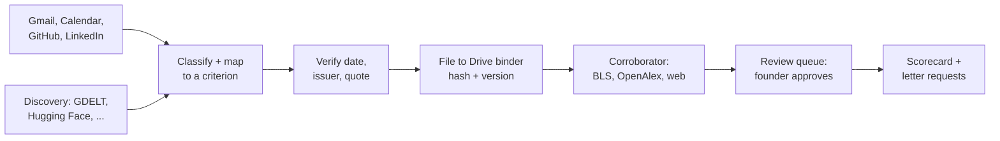

# Exhibit

Exhibit watches the places a founder's extraordinary-ability evidence already lands — Gmail,
Google Calendar, GitHub, LinkedIn, and public sources she never saw — and files each real piece as
a dated, sourced exhibit under the right O-1A/EB-1A criterion, so the file is full before an
attorney ever asks for it.

**Exhibit is not legal advice.** It never states that anyone qualifies for a visa or green card. It
says which working rule an item meets, and it leaves anything uncertain for an attorney to decide.

## How it works

A classifier and criterion mapper sort each item into one of the O-1A/EB-1A criteria (or reject it,
with a reason); a verifier confirms the original date and issuer; a filer writes the untouched
original plus a content hash to a private Drive binder; a Corroborator researches the numbers that
give an exhibit weight, using structured verifier APIs first and restricted web search second;
every figure and every letter request waits for the founder's own decision before anything is
written or sent.



**PRD 6.13 — the text channel.** A two-way message thread (Twilio, free trial: graded over SMS in
Arga's Twilio twin, live on the WhatsApp Sandbox) turns every inbound text into exactly one of six
fixed commands — approve/deny, pause/resume, add evidence, next, status, stop — using structured
output, and never acts on a text from any number but the founder's verified one.

**PRD 6.14 — the integration lineup.** Beyond Google and GitHub, Exhibit finds evidence the founder
never saw (GDELT, Hacker News, Product Hunt, OpenReview, ORCID, Hugging Face, SEC EDGAR, USPTO),
takes numbers from official data (OpenAlex, Crossref, Semantic Scholar, BLS, O*NET), makes the
binder tamper-evident (Internet Archive, OpenTimestamps), and sends letters for signature (Dropbox
Sign) — every integration on a free tier.

## Quickstart

```bash
npm ci
npx tsx src/cli.ts demo                    # the two-minute demo (PRD 14), on the full synthetic year
npx tsx src/cli.ts eval --attempts 3       # runs the Arga scenario matrix, 3 attempts each, graded from twin state
npx tsx src/cli.ts brief                   # regenerates BRIEF.md's numbers from the run ledger
```

There is no `verify` subcommand in `src/cli.ts` yet — see "patches needed" below. `npm run brief`
and `npm run eval` (see `package.json`) wrap the same commands.

## How it proves itself

Exhibit's proof is a loop across four platforms, each answering a different question (PRD 12.6):

- **Arga** (before real data): every behavior is proven first against in-memory twins seeded with a
  synthetic year and known traps, scenarios S1-S24, 3 graded attempts each, graded from twin end
  state, not from Exhibit's own logs.
- **Lemma** (on every run): traces are audited against a local mirror of Lemma's seven failure
  modes (skipped work, out-of-scope work, instruction violation, integration failure, retry loop,
  hallucination, communication failure) — `src/observability/audit.ts` runs the same check when a
  live Lemma project is not connected.
- **Userlens worth-sending** (at every message to a person): every letter request and every
  proactive text to the founder passes a send/revise/hold gate before anything goes out, and a
  `send` still needs the founder's own approval before Gmail sends it.
- **The prompt-graph dependents check** (at every rule change): the criterion definitions live as
  shared fragments; changing one runs `affected()` over the dependency graph to list every prompt
  that uses it, and picks the Arga scenarios that exercise those prompts to re-run before the
  change merges.
- **The mutation check**: `npx tsx src/cli.ts mutate` flips known trap/qualifying answers and
  confirms the graded scenarios actually fail when the underlying behavior is wrong — a guard
  against a scenario that would pass no matter what the code does.

**Honesty notes, stated plainly:**

- Exhibit's twins (`src/twins/*.ts`) are **in-memory fakes built for this project**, not Arga
  Labs' hosted twin infrastructure. No `docs/ARGA.md` exists in this repo describing a hosted-twin
  integration, so nothing here claims one.
- When `ANTHROPIC_API_KEY` is unset (or `EXHIBIT_LIVE_MODEL` isn't `1`), Exhibit runs a
  **deterministic heuristic stand-in model** (`src/models/heuristic.ts`), not a real LLM call — see
  `harness/env.ts`'s `defaultModel()`.
- The `.example` outlets, journals and programs in the demo and test corpus (`harness/corpus.ts`)
  are fictional, and every discovery/verifier-API response used in the harness and demo is a
  **recorded fixture** (`harness/fixtures/*.ts`) replayed through a `FixtureTransport` — never a
  real network call.
- **Lemma is not connected** unless `LEMMA_API_KEY`/`LEMMA_PROJECT_ID` are set (`.env.example`).
  Without them, only the local audit mirror runs.
- **uberprompt itself is not run** — Clera's tool has no public license available to this build.
  Exhibit instead has its own dependents/mutation check (`src/rules/graph.ts`'s `affected()`) over
  the same shared-fragment prompt-graph file format uberprompt targets, so a rule change still gets
  a real blast-radius list and a real re-run, just from Exhibit's own implementation.

No pass counts or scenario numbers are hardcoded anywhere in this README — run `npx tsx src/cli.ts
eval` and read `BRIEF.md` (generated by `npx tsx src/cli.ts brief`) or the JSON under `reports/` for
current numbers, so nothing here can go stale.

## Repository map

| Path | What's there |
|---|---|
| `src/agent.ts` | The one run loop: intake through scorecard, plus the 6.13/6.14 extension hooks |
| `src/pipeline/`, `src/rules/` | Classify, map, verify; the criterion prompt graph and trap rules |
| `src/binder/`, `src/review/` | Drive filing, scorecard rendering, the review queue |
| `src/research/`, `src/integrations/` | The Corroborator and every 6.14 adapter |
| `src/letters/`, `src/text/`, `src/notify/`, `src/discovery/`, `src/integrity/` | Letter requests and signing, the text channel, notifications, discovery, tamper-evidence |
| `src/twins/`, `harness/` | In-memory fakes, fixtures, and the graded Arga-style scenario matrix (`harness/scenarios/`) |
| `src/apps/live/`, `src/config.ts` | Real clients, wired only when their env vars are present |
| `src/demo.ts`, `src/cli.ts` | The two-minute demo and the `exhibit` CLI |
| `docs/PRD.md`, `docs/ARCHITECTURE.md`, `docs/reliability-brief-template.md` | Spec, code map, and the brief skeleton `npx tsx src/cli.ts brief` fills in |
| `constraints/hard-constraints.md` | The 19 hard rules, mapped to enforcement |

## Live mode and environment variables

Live mode is configured entirely through environment variables read by `src/config.ts`; the file
`.env.example` at the repository root documents every one of them, grouped by area: the founder
profile, Google OAuth2, GitHub, LinkedIn, Anthropic, Lemma, Arga twin provisioning, the ledger
path, the Twilio text channel (6.13), the structured verifier APIs and discovery adapters (6.14),
the tamper-evident binder (Internet Archive/OpenTimestamps), Dropbox Sign, and DeepL. Every
integration is enabled only when its own credentials are present — nothing turns on silently, and
`buildLiveDeps` prints a features report at startup saying what did and didn't load.

`web/setup.html` is the one-screen setup page described in PRD 4.1 (what Exhibit does and never
does, connecting Google/GitHub/LinkedIn with minimal scopes, a phone number, route and quiet
hours). For the hackathon build this page is not wired to the harness; the demo starts at the first
scorecard instead (PRD 4.1, "for the hackathon").

## Privacy and safety

Exhibit's rules are enforced as described in [constraints/hard-constraints.md](constraints/hard-constraints.md)
and mapped to code in [docs/ARCHITECTURE.md](docs/ARCHITECTURE.md). In short: identity numbers are
redacted before any model call or log (`src/pipeline/redact.ts`); only redacted, opt-in text ever
reaches DeepL; the binder is never shared; and everything in this repository's harness, tests and
demo runs on **synthetic data only** — a fictional founder, "Dara Voss", over a fictional year. No
real inbox and no real immigration data are used anywhere in this build.

## Integration status (as of 2026-09-13)

Generated by reading `src/integrations/registry.ts` and its module-presence check at write time.
"Built" here means the module exists on disk and exports something real, not that it ran; see
`npx tsx src/cli.ts eval` and `BRIEF.md` for which of these were exercised (fixtures) or used live
in a given run — that classification (`used_live` / `exercised_with_fixtures` /
`built_not_exercised`) depends on the run's own `integration_call` ledger events, not on this table.

| Integration | Module | On disk? |
|---|---|---|
| GDELT | `src/integrations/gdelt.ts` | Built |
| Hugging Face Hub | `src/integrations/huggingface.ts` | Built |
| Hacker News | `src/integrations/hackernews.ts` | Built |
| Product Hunt | `src/integrations/producthunt.ts` | Built |
| Podcast Index | `src/integrations/podcastindex.ts` | Built |
| USPTO PatentSearch | `src/integrations/uspto.ts` | Built |
| OpenReview | `src/integrations/openreview.ts` | Built |
| ORCID | `src/integrations/orcid.ts` | Built |
| SEC EDGAR (Form D) | `src/integrations/edgar.ts` | Built |
| OpenAlex | `src/integrations/openalex.ts` | Built |
| Crossref | `src/integrations/crossref.ts` | Built |
| Semantic Scholar | `src/integrations/semanticscholar.ts` | Built |
| BLS (90th-percentile wage) | `src/integrations/bls.ts` | Built |
| O*NET | `src/integrations/onet.ts` | Built |
| ecosyste.ms | `src/integrations/ecosystems.ts` | Built |
| Platform stats (GitHub/Google plumbing) | `src/integrations/platformstats.ts` | Built |
| OpenTimestamps | `src/integrity/opentimestamps.ts` / `src/integrity/ots.ts` | Built |
| Internet Archive Save Page Now | `src/integrity/archive.ts` | Built |
| Dropbox Sign | `src/integrations/dropboxsign.ts` | Built |
| DeepL API Free | `src/integrations/deepl.ts` | Built |
| Twilio (text channel) | `src/apps/live/twilio.ts` | Built |
| Text command channel | `src/text/channel.ts`, `src/text/commands.ts` | Built |
| Structured research dispatch | `src/research/structured.ts` | Built |
| USCIS Case Status API (Torch) | `src/integrations/uscis.ts` | Sandbox-tested only; production access pending USCIS approval, never claimed live |

This table is a snapshot from a single read of the registry; it can drift as the repository
changes. Re-run `src/integrations/registry.ts`'s `integrationStatus()`/`summarizeIntegrations()`
(wired into `npx tsx src/cli.ts brief`) for a live view joined to actual run events.

## License

No license specified yet.
