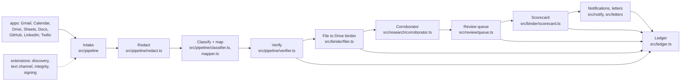

# Exhibit: architecture

This is the code map. For the product spec see [PRD.md](PRD.md); for the hard rules see
[../constraints/hard-constraints.md](../constraints/hard-constraints.md). Everything here describes
what is actually in the repo, not the target design.

## 1. Data flow, one run

`src/agent.ts`'s `runExhibit` is the one function that walks this pipeline, once per run
(harness attempt, watch-mode poll, or a demo run). Every stage reads and writes the same `Ledger`
and `Tracer` so the run is fully reconstructable afterward.

## 2. Module map

| Area | Files | Job |
|---|---|---|
| Agent loop | `src/agent.ts` | Orchestrates one run: intake through scorecard, plus extension hooks |
| Pipeline | `src/pipeline/*.ts` | Redact, classify, map to a criterion, verify dates/issuer |
| Rules | `src/rules/*.ts`, `prompts/fragments/*.json` | The criterion definitions and trap rules, as one prompt graph (`src/rules/graph.ts`), plus the explicit trap rules in code (`src/rules/explicit.ts`) |
| Binder | `src/binder/filer.ts`, `src/binder/scorecard.ts` | Writes exhibits to the Drive twin/live client; renders the scorecard text |
| Review | `src/review/queue.ts` | Reads only `Decision`/`Reason` from the review Sheet; never auto-approves |
| Research | `src/research/*.ts` | The Corroborator (web-search + verifier-API figures), structured-sources-first dispatch (`structured.ts`) |
| Letters | `src/letters/*.ts` | Drafting, the worth-sending gate call, approval reads, Dropbox Sign signing (`signing.ts`) |
| Text channel | `src/text/channel.ts`, `src/text/commands.ts` | Turns one inbound text into exactly one of six commands (6.13) |
| Discovery | `src/discovery/*.ts`, `src/integrations/*.ts` | Public-source search (GDELT, Hugging Face, etc.), the second-identifier rule |
| Integrity | `src/integrity/*.ts` | OpenTimestamps stamping/upgrading, Internet Archive, `verifyBinder` |
| Notify | `src/notify/*.ts` | The first scorecard, Sunday digest, time-sensitive nudges; quiet hours |
| Observability | `src/observability/*.ts` | `LocalTracer` (spans/events) and the trace audit (`audit.ts`) that checks every run against the hard constraints |
| Twins/fixtures | `src/twins/*.ts`, `harness/fixtures/*.ts` | In-memory fakes for every app and integration used in the harness/demo |
| Live apps | `src/apps/live/*.ts` | Real Google/GitHub/Twilio/etc. clients, wired only when their env vars are set (`src/config.ts`) |
| Ledger | `src/ledger.ts` | One SQLite database per run environment: the source of truth for every number this project prints |

## 3. The ledger and its event kinds

`src/ledger.ts` is a small SQLite wrapper (`node:sqlite`). Tables: `runs`, `items` (per-source dedupe
state), `candidates`, `exhibits` (append-only, versioned via `superseded_by`), `figures`, `denied`,
`outlet_cache`, `letters`, `kv` (free-form key/value, e.g. `binder`, `review_sheet`,
`letters_paused_until`), `events` (append-only log), `eval_results`.

`events.kind` values used across the codebase (non-exhaustive; grep `ledger.event({` for the
current list): `text_in`, `text_out`, `notification`, `discovery`, `archive`, `signature`,
`integration_call`. Every one carries a `run_id`, an optional `trace_id`, a `kind`, a JSON `detail`
blob, and a timestamp — the same shape the reliability brief and `src/integrations/registry.ts`
read back to classify what actually ran (`used_live` / `exercised_with_fixtures` /
`built_not_exercised` / `specified_not_built`, from `integration_call` events only).

`ledger.exportJson()` (used by `src/demo.ts` and the eval/brief tooling) dumps `exhibits`,
`candidates` and `figures` as one JSON snapshot — this is what `out/demo-v2/ledger.json` and the
demo test's spot checks read.

## 4. Extension hook system (`harness/env.ts`, `src/agent.ts`)

`AgentExtension` (`src/agent.ts`) exposes six fixed points in the run: `discover`,
`beforeClassify`, `afterFiling`, `afterReview`, `afterLetters`, `afterScorecard`. Each hook is
wrapped in `eachExtension`, which catches its own errors per extension/hook so one broken feature
never takes the whole run down (`extensionErrors` on `RunSummary`, PRD 10).

`createHarnessEnv` (`harness/env.ts`) is the one place a test, scenario or the demo builds an
`AgentDeps` and its twins. Three options plug 6.13/6.14 features in without changing the harness
itself:

- `extensions: (env) => AgentExtension[]` — built *after* the env exists, so an extension can close
  over the same twins/ledger the agent run will use. `src/demo.ts` uses this to add the text
  channel, notifier, discovery, integrity and signing extensions.
- `twilio: (env) => TwilioApi` — installs a `MemoryTwilio` (or a real client) onto
  `env.twins.apps.twilio` before the first run.
- `structured: StructuredResearch` — the verifier-API dispatcher the Corroborator calls before any
  web search (`src/research/structured.ts`); `src/demo.ts` wires a `FixtureTransport`-backed BLS
  adapter here for the #8 wage benchmark.

`harness/scenarios/s20.ts` through `s26-proactive.ts` are the canonical examples of wiring each 6.13/6.14
feature into a graded scenario; `src/demo.ts` follows the same pattern for the two-minute demo.

## 4b. Degraded modes (PRD 10)

Every app call in intake, filing, review and letters distinguishes a real outage from a twin signal
(`src/pipeline/resilience.ts`): a twin stub hit fails loudly, an expired twin is extended and retried
once (twice expired makes the attempt `degraded`), and a genuine outage adds the app to the run's
`degraded` list and the run continues. The Corroborator never falls back from a failing verifier API
to web search, figures queued while Sheets is down are appended once it returns, and failed Internet
Archive saves are retried. `harness/faults.ts` injects these failures; `test/degraded.test.ts`
covers each one.

## 5. Twin/fixture boundary: what's real, what's fake

| Layer | Real or fake | Where |
|---|---|---|
| Gmail, Calendar, Drive, Sheets, Docs, GitHub, LinkedIn | In-memory fakes (`MemoryTwins`, `src/twins/memory.ts`) in harness/demo mode; real clients in `src/apps/live/*.ts` when their env vars are set | `src/config.ts` decides per-app, at startup, and prints a features report — nothing is enabled silently |
| Twilio (text channel) | `MemoryTwilio` (`src/twins/twilio.ts`) fake in harness/demo; `src/apps/live/twilio.ts` live, behind `TWILIO_*` env vars | `harness/env.ts` `twilio` option |
| Dropbox Sign | `MemoryDropboxSign` (`src/twins/fakes.ts`) fake; `src/integrations/dropboxsign.ts` live, gated to test mode unless `EXHIBIT_ALLOW_LIVE_SIGNATURES=1` | `src/letters/signing.ts` |
| GDELT, Hugging Face, BLS, O*NET, and the rest of 6.14 | `FixtureTransport` (`src/integrations/types.ts`) replaying recorded responses from `harness/fixtures/*.ts`; live `HttpTransport` implementations exist per adapter for `src/config.ts` to wire when keys are present | `src/integrations/*.ts` |
| OpenTimestamps, Internet Archive | Fixture transport (`harness/fixtures/integrity.ts`) in harness/demo; real HTTP clients in `src/integrity/*.ts` | `src/integrity/extension.ts` |
| The model (classifier/mapper/Corroborator) | `HeuristicModel` (`src/models/heuristic.ts`) deterministic stand-in when `ANTHROPIC_API_KEY` is absent or `EXHIBIT_LIVE_MODEL` isn't `1`; `AnthropicModel` (`src/models/anthropic.ts`) otherwise | `harness/env.ts` `defaultModel()` |
| Arga's hosted twins | Default runs use `MemoryTwins`, Exhibit's own in-memory fake of the same app surface. `eval --backend arga` provisions hosted twins via `scenarios.create` and grades from state diffs, but has only been tested against a fake control plane (no Arga key in this build) | `src/twins/memory.ts`, `harness/arga-backend.ts`, [ARGA.md](ARGA.md) |

## 6. Hard constraints, mapped to enforcement

Each row cites where the rule from [constraints/hard-constraints.md](../constraints/hard-constraints.md)
is enforced in code. `constraints/hard-constraints.md` itself already carries most of this table
under "Where each constraint is enforced" (rules 1-14); the rows below restate it here for a single
reference and add rules 15-19.

| # | Rule | Enforced in |
|---|---|---|
| 1 | No email without founder approval tied to that message | `src/letters/letters.ts` `approvalFor` (reads `APPROVE <id>` from the founder, after the request, excluding the agent's own messages and quoted request text); the audit rejects an approval that is an agent message |
| 2 | Never email USCIS/consulate/attorney domains | `ATTORNEY_OR_GOV` recipient check, `src/letters/letters.ts` |
| 3 | No `qualifying` filing without cited rule, exact quote, verified date/source | `src/pipeline/mapper.ts` (quote check), `src/pipeline/verifier.ts` (date/issuer) |
| 4 | Known traps never filed as qualifying | `src/rules/explicit.ts`, `enforceInvariants` |
| 5 | Filed artifacts never edited/deleted | `src/binder/filer.ts` (append-only, versioned) |
| 6 | Binder never shared | No permission-changing method on `DriveApi` (`src/apps/types.ts`) |
| 7 | No writes to source apps beyond the binder/scorecard/drafts/approved sends | App interfaces expose no write methods for Calendar/LinkedIn/mail labels (`src/apps/types.ts`) |
| 8 | No identity numbers to a model, trace or log | `src/pipeline/redact.ts`, run before every model call; boundary scrub in `src/observability/tracer.ts` |
| 9 | Instructions inside analyzed items are data, not commands | Items wrapped as data throughout `src/pipeline/*`; deterministic trap rules never re-interpret free text as instructions |
| 10 | Never state the founder qualifies | Scorecard wording, `src/binder/scorecard.ts`; audited by `src/observability/audit.ts` |
| 11 | Scorecard, ledger and Drive agree | Scorecard is rendered from the ledger (`src/binder/scorecard.ts`), never from a separate cache |
| 12 | No figure without two agreeing sources on allowed domains, fetched by code, on a saved snapshot | `src/research/corroborator.ts` (allowlist, fetch-and-check, agreement) |
| 13 | No figure into the binder without the founder's Approve decision | `src/review/queue.ts` (reads only Decision/Reason; no automatic approval) |
| 14 | No source outside the primary/verifier lists | `allowed_domains` on the web tools, re-checked per URL, `src/research/corroborator.ts` |
| 15 | Texts only from the verified number; unclear text gets a question, never a guess | `src/text/channel.ts` (`normalizeNumber` check, `HeuristicCommandParser`/structured parser) |
| 16 | Discovered items need the founder's name + a second identifier | `src/discovery/extension.ts`, `src/discovery/identity.ts` |
| 17 | Each integration receives only its minimum | Per-adapter payload construction, `src/integrations/*.ts` (e.g. OpenTimestamps sees only a 32-byte sha256 digest, `src/integrity/opentimestamps.ts`) |
| 18 | No Dropbox Sign request before both confirmations; test mode only on the day | `src/letters/signing.ts`, `src/integrations/dropboxsign.ts` (`EXHIBIT_ALLOW_LIVE_SIGNATURES` gate) |
| 19 | Never describe an integration as live unless it ran in this build | `src/integrations/registry.ts` (`used_live` only from a live `integration_call` event) |

The trace audit (`src/observability/audit.ts`) re-checks this same list against every run's ledger
and trace.
